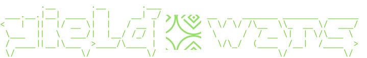

# YieldWars: A Real-Time Crypto Mining Simulation Game



## 🚀 Project Overview

YieldWars is a real-time cryptocurrency mining simulation game built on Solana using MagicBlock's Ephemeral Rollup technology. Players manage virtual resources including cryptocurrencies and mining hardware, focusing on strategic decision-making and resource optimization to maximize returns.

Created for the MagicBlock Real-Time Hackathon, YieldWars demonstrates the capabilities of real-time, high-performance on-chain gaming using Solana's infrastructure accelerated by MagicBlock's engine.

## 🏆 MagicBlock Real-Time Hackathon

YieldWars was developed for the MagicBlock Real-Time Hackathon, a high-velocity builder sprint designed for developers eager to explore the bleeding edge of Solana performance. The hackathon challenged teams to build real-time, high-performance applications powered by MagicBlock's ephemeral rollup infrastructure.

### Hackathon Tracks

The hackathon featured four tracks, with YieldWars fitting into the "Fully Onchain Game" category:

- 🏦 Real-Time CLOB – Build the next-gen onchain exchange
- 📈 Retail Options – Create intuitive, real-time options trading
- 📰 Trading News App – Turn real-time market signals
- 🎮 **Fully Onchain Game** – PvP games that actually feel real-time

### How YieldWars Meets the Challenge

YieldWars demonstrates several key features requested by the hackathon:

1. **Real-Time Performance**: Using MagicBlock's engine for ultra-low latency transactions
2. **Fully On-Chain Logic**: All game mechanics are implemented on-chain using Bolt/ECS
3. **Rich Interaction**: Multiple systems interacting in real-time (economy, production, market)
4. **Innovative Gameplay**: Combines crypto trading simulation with resource management
5. **Accelerated with MagicBlock Engine**: Integrated with MagicBlock's Ephemeral Rollup technology

The project directly addresses the need for real-time, interactive gaming experiences that maintain the benefits of blockchain while delivering Web2-level performance.

## 🎮 Game Mechanics

### User Gameplay Flow

The player experience in YieldWars follows a strategic progression:

1. **Initial Setup**
   - Connect wallet using Solana Wallet Adapter
   - Initialize user wallet with starting funds (USDC)
   - Create player entity with wallet component

2. **Resource Acquisition**
   - Purchase GPUs from the Supply Shack
   - Different GPU types available: Entry, Standard, Premium
   - Each GPU has different attributes: hash rate, power consumption, etc.
   - GPUs cost different amounts of USDC (50-200 USDC)

3. **Production Management**
   - Activate GPUs to begin resource production
   - GPUs produce USDC and AiFi tokens at specified rates
   - Resources accumulate over time
   - Collect resources periodically
   - Pay operating costs to maintain production

4. **Optimization & Upgrades**
   - Upgrade GPUs to increase production efficiency
   - Higher levels increase resource generation rates
   - Upgrades require USDC and AiFi tokens
   - Manage cooldown periods between upgrades

5. **Staking Mechanics**
   - Stake GPUs for additional rewards
   - Staking pauses regular production but provides passive income
   - Minimum staking periods for penalty-free unstaking
   - Collect staking rewards periodically

6. **Trading & Economy**
   - Exchange between different cryptocurrencies (USDC, BTC, ETH, SOL, AiFi)
   - Market rates fluctuate based on price dynamics
   - Pay transaction fees on exchanges (1%)
   - Optimize portfolio based on market trends

7. **Marketplace**
   - Buy and sell assets through marketplace listings
   - Transfer ownership of assets between players
   - List items at custom prices
   - Cancel or update listings

8. **Competition & Leaderboards**
   - Total wealth is calculated for leaderboard ranking
   - SOAR integration shows player standings
   - Compete for highest wealth accumulation
   - Potential for achievements and rewards

### Resource Types

- **USDC**: Base currency for most transactions
- **BTC, ETH, SOL**: Tradable cryptocurrencies with dynamic values
- **AiFi**: Special token produced by GPUs, used for advanced upgrades
- **GPUs**: Mining hardware that produces resources
- **Data Centers, Land Rights, Energy Contracts**: Advanced assets

### Game Currency System

All currency values in YieldWars use 6 decimal places, where 1,000,000 units = $1. This applies to all cryptocurrencies and is consistent across all systems, components, and interfaces.

Examples:
- 1,000,000 = $1 USDC
- 60,000,000,000 = $60,000 BTC
- 3,000,000,000 = $3,000 ETH
- 100,000 = $0.10 (10 cents)

### Game Balance

The game is balanced through several mechanisms:
- Progressive difficulty through increasing upgrade costs
- Operating costs that scale with production capacity
- Market dynamics that prevent single-strategy dominance
- Time-gating through cooldown periods
- Resource management trade-offs between different currencies
- Risk/reward balance in staking mechanics

## 🖥️ UI Interface Elements

### Supply Shack
The Supply Shack is the primary interface for purchasing new GPUs:
- Displays available GPU types (Entry, Standard, Premium)
- Shows GPU stats: hash rate, power consumption
- Visual design uses color coding for different GPU types:
  - Entry: Green theme (#39FF14)
  - Standard: Blue theme (#0094FF)
  - Premium: Purple theme (#A855F7)
- Interactive elements with glowing effects and animations

### GPU Management Interface
Players manage their GPUs through a dedicated interface:
- Toggle production on/off
- Collect accumulated resources
- Initiate upgrades to increase efficiency
- Stake/unstake GPUs for rewards
- View detailed stats and performance metrics

### Marketplace
The marketplace allows trading assets with other players:
- List GPUs and other assets for sale
- View available listings
- Purchase assets from other players
- Transfer ownership directly
- Cancel or update existing listings

### Leaderboard
The leaderboard shows competitive standings:
- Player rankings based on total wealth
- Wealth calculation includes all currencies and assets
- Historical performance tracking
- Achievement badges and milestones

## 🛠️ Technology Stack

### Frontend
- **Next.js 15** with App Router and TypeScript
- **React 18** for component-based UI
- **Tailwind CSS** for styling
- **Redux** and **Zustand** for state management
- **Privy** for authentication
- **Solana Wallet Adapter** for wallet integration

### Backend
- **Solana Blockchain** for on-chain logic
- **MagicBlock's Bolt Framework** for ECS architecture
- **Anchor** for Solana program development
- **SOAR SDK** for leaderboard integration

## 📐 Architecture

YieldWars implements the Entity-Component-System (ECS) pattern:

- **Entities**: Core objects like players, currencies, and hardware
- **Components**: Data containers attached to entities
  - Wallet, Ownership, Production, Upgradeable, Stakeable, Price
- **Systems**: Logic units that operate on entities with specific components
  - Economy, Production, Upgrade, Staking, Market, etc.

### Entity-Component-System Implementation Details

#### Components

YieldWars implements the following key components:

**Wallet Component**
```rust
pub struct Wallet {
    pub usdc_balance: u64,
    pub btc_balance: u64,
    pub eth_balance: u64,
    pub sol_balance: u64,
    pub aifi_balance: u64,
}
```
Tracks currency balances for players.

**Production Component**
```rust
pub struct Production {
    pub usdc_per_hour: u64,
    pub aifi_per_hour: u64,
    pub last_collection_time: i64,
    pub efficiency_multiplier: u32,
    pub producer_type: u8,
    pub level: u8,
    pub is_active: bool,
    pub operating_cost: u64,
}
```
Defines resource generation capabilities for GPUs and other productive assets.

**Upgradeable Component**
```rust
pub struct Upgradeable {
    pub current_level: u8,
    pub max_level: u8,
    pub last_upgrade_time: i64,
    pub can_upgrade: bool,
    pub upgradeable_type: u8,
    pub next_upgrade_usdc_cost: u64,
    pub next_upgrade_aifi_cost: u64,
    pub upgrade_cooldown: u32,
    pub next_usdc_boost: u32,
    pub next_aifi_boost: u32,
}
```
Manages upgrade paths for entities like GPUs.

#### Systems

These components are manipulated by various systems:

**EconomySystem**
- Handles transfers between wallets
- Manages currency exchanges
- Processes purchases and payments

**ResourceProductionSystem**
- Calculates time-based resource accrual 
- Applies efficiency bonuses
- Manages operating costs
- Controls resource collection logic

**UpgradeSystem**
- Verifies upgrade requirements
- Processes upgrade costs
- Applies production boosts
- Manages level progression

**StakingSystem**
- Handles staking and unstaking of GPUs
- Calculates time-based rewards
- Applies early unstaking penalties
- Manages reward claims

**MarketSystem**
- Manages asset listings
- Processes asset purchases
- Handles ownership transfers
- Controls marketplace dynamics

## ⚙️ Technical Features

- **Fully On-Chain Logic**: Game state and logic live entirely on the Solana blockchain
- **Real-Time Performance**: Leverages MagicBlock's Ephemeral Rollup technology
- **Price Dynamics**: Simulated market conditions for virtual currencies
- **Resource Production**: Time-based resource generation with upgrade paths
- **Asset Marketplace**: Full trading and ownership transfer system
- **Leaderboard**: SOAR integration for competitive gameplay

### UI Features

- **Real-time Transaction Monitoring**: Enhanced transaction monitoring for Bolt ECS
- **Wallet Integration**: Seamless connection with Solana wallets
- **Supply Shack**: GPU purchasing interface
- **Marketplace**: Trade currencies and assets
- **Diagnostic Tools**: Monitoring blockchain state for debugging

## 🔌 MagicBlock Integration

YieldWars leverages two key technologies from MagicBlock to deliver a high-performance, real-time gaming experience on Solana:

### Bolt ECS Framework Integration

The project uses Bolt's component structure with the `#[component]` macro and system structure with the `#[system]` macro:

```rust
#[system]
pub mod economy {
    #[arguments]
    pub struct Args {
        pub transaction_type: u8,
        pub currency_type: u8,
        pub destination_currency_type: u8,
        pub amount: u64,
    }
    
    pub fn execute(ctx: Context<Components>, args: Args) -> Result<Components> {
        // Logic implementation
    }
    
    #[system_input]
    pub struct Components {
        pub source_wallet: Wallet,
        pub destination_wallet: Wallet,
        pub source_price: Price,
        pub destination_price: Price,
    }
}
```

#### Bolt-Specific Features Used

1. **Component Metadata Management**: Automatic handling of the `bolt_metadata` field
2. **System Input Structure**: Defining required components for system operations
3. **Bolt CLI Tooling**: Using commands like `bolt component [name]` and `bolt system [name]`
4. **Component Dependencies**: Proper configuration in Cargo.toml files
5. **Error Handling**: Using the `#[error_code]` macro for system-specific error definitions

### Frontend Integration with Bolt

The frontend uses the `@magicblock-labs/bolt-sdk` to interact with the Bolt ECS framework:

```typescript
// Example of purchasing a GPU asset
const result = await purchaseGpu({
    worldPda: constants.WORLD_ADDRESS.toBase58(),
    gpuEntityPda: gpuEntityPda,
    buyerEntityPda: userEntity.entityPda,
    adminEntityPda: adminEntityPda,
    gpuPrice: gpuPrice,
    userWalletPublicKey: user.wallet.address,
    sourcePricePda: usdcPricePda,
    destinationPricePda: usdcPricePda
});
```

### SOAR SDK Integration

YieldWars integrates with MagicBlock's SOAR SDK for leaderboard functionality:

```typescript
// Example of calculating player wealth for leaderboard
const result = await calculateWealth({
    worldPda: constants.WORLD_ADDRESS.toBase58(),
    playerEntityPda: userEntity.entityPda,
    walletPda: userEntity.walletComponentPda,
    usdcPricePda: userEntity.priceComponentPdas[CurrencyType.USDC],
    btcPricePda: userEntity.priceComponentPdas[CurrencyType.BTC],
    ethPricePda: userEntity.priceComponentPdas[CurrencyType.ETH],
    solPricePda: userEntity.priceComponentPdas[CurrencyType.SOL]
});
```

### Real-Time Performance with MagicBlock Engine

YieldWars leverages MagicBlock's Ephemeral Rollup technology for:
- Ultra-low latency transactions
- High transaction throughput
- Congestion-free gaming experience
- Web2-like performance with Web3 security

## 🔍 Bolt Rollup Monitoring Tools

As part of the YieldWars development, we created a comprehensive suite of monitoring and diagnostic tools specifically designed for Bolt ECS development on Solana. This custom-built toolset provides developers with unprecedented visibility into on-chain data and program execution.

### MagicBlock Monitor Features

The monitoring suite consists of three integrated tools:

1. **Transaction Monitor**
   - Real-time tracking of all Bolt ECS transactions
   - Enhanced parsing of Bolt-specific program logs
   - Visual indicators for different transaction types (entity creation, component updates, system applications)
   - Transaction history and filtering capabilities
   - Automatic endpoint selection for reliable connection

2. **PDA Monitor**
   - Tracks Program Derived Addresses (PDAs) for Bolt entities and components
   - Visualizes entity-component relationships
   - Displays component data in a structured format
   - Real-time updates of component state changes
   - Support for different account types and data structures

3. **Bolt Diagnostics**
   - System status indicators for Bolt World, Registry, and Entity programs
   - Connectivity testing with different Solana endpoints
   - Framework configuration verification
   - Error pattern recognition and troubleshooting guidance
   - Validator connection reliability testing

### Developer-Centric Design

The monitoring tools were designed specifically for Bolt ECS development needs:

- **Persistent Connection**: Automatically attempts multiple endpoint variants (localhost, 127.0.0.1) to establish reliable connections
- **Enhanced Log Parsing**: Specialized parsing of Bolt-specific log formats to extract meaningful information
- **Visualization**: Clear, structured display of complex on-chain data
- **Cross-Referenced Data**: Links between related transactions, entities, and components
- **Error Handling**: Detailed error information and troubleshooting suggestions

### Test Environment Integration

A specialized Test Monitor provides additional features for Bolt/Anchor test environments:

- Targeted monitoring during test execution
- Step-by-step tracking of test progression
- Common error pattern recognition
- Test-specific workflow visualization
- Troubleshooting tips for test failures

These monitoring tools significantly accelerated our development cycle by providing immediate feedback on Bolt ECS operations, reducing debugging time, and enabling more efficient testing of on-chain game mechanics.

## 🎨 Image Factory: Visual Assets for Yield Wars

### Tool Innovation
As part of our Yield Wars hackathon project, we developed Image Factory - an AI-powered asset generation tool that produced all in-game icons and visual elements.

### Key Features
- **Custom API Wrapper**: Streamlined OpenAI's GPT-Image model with our own templates
- **Retro Terminal Aesthetic**: Consistent neon green-on-black styling across all assets
- **Batch Processing**: Generated 100+ unique game icons in minutes
- **Developer-Friendly**: Simple endpoints integrated directly into our workflow
- **Sandwich Prompting**: Applied pre and post-prompt templates to maintain visual consistency
- **Template Management**: Custom template system for creating and saving different visual styles
- **Vercel AI SDK Integration**: Leveraged Vercel's optimized SDK for efficient API communication
- **Next.js Architecture**: Built as a standalone web application with modern React patterns
- **Configurable Quality Settings**: Support for various sizes and quality levels (standard/HD)
- **Flexible API Endpoints**: REST API with JSON configuration for programmatic access

### Technical Implementation

#### Architecture
Image Factory is built as a standalone Next.js application with:
- TypeScript for type safety and developer experience
- Tailwind CSS for styling the user interface
- Vercel AI SDK for optimized OpenAI API integration
- Custom prompt templating system for consistent visuals
- Vercel Blob Storage for persisting generated images

#### Prompt Engineering
The tool uses a technique called "sandwich prompting" where the user's core description is wrapped between prefix and suffix templates:

```
[PREFIX TEMPLATE: "retro terminal aesthetic, neon green on black background, pixel art style, glowing edges,"] 
+ [USER PROMPT: "mining GPU with heat sinks"] 
+ [SUFFIX TEMPLATE: ", high contrast, digital art, retrowave style"]
```

This approach ensured all game assets maintained a cohesive visual language while allowing for unique designs.

#### API Integration
The Image Factory exposes a RESTful API for programmatic access:

```typescript
// Example API call to generate an image
const response = await fetch('/api/generate', {
  method: 'POST',
  headers: { 'Content-Type': 'application/json' },
  body: JSON.stringify({
    prompt: 'mining GPU with cooling fans',
    template: 'retro-terminal',
    size: '1024x1024',
    quality: 'standard',
    style: 'vivid'
  })
});

const { imageUrl } = await response.json();
```

The API supports:
- Custom prompt templates
- Multiple image dimensions (1024x1024, 1024x1792, 1792x1024)
- Quality settings (standard, HD)
- Style options (natural, vivid)

#### Workflow Integration
Image Factory was integrated into our development workflow through:
1. A web interface for quick one-off asset generation
2. A scripts directory with batch processing capabilities
3. An API endpoint for programmatic access from other tools
4. Direct integration with the YieldWars UI component library

#### YieldWars Integration
For YieldWars, we created a specialized template that captured the game's retro-futuristic aesthetic:

1. We defined a custom "YieldWars-GPU" template in the Image Factory
2. Used the API to generate all hardware variants (Entry, Standard, Premium)
3. Created matching icons for each cryptocurrency type
4. Integrated the consistent visual language across UI components

### Images Created
Using Image Factory, we generated:
- Resource icons (USDC, BTC, ETH, SOL, AiFi)
- Hardware visuals (GPUs with different visual tiers)
- UI elements (buttons, panels, backgrounds)
- Marketing materials (logo, promotional images)
- Gameplay elements (upgrade effects, production animations)

### Impact
Image Factory eliminated the need for dedicated artists while maintaining visual cohesion. This allowed our engineering team to focus on gameplay mechanics while still delivering a visually distinctive experience. All resource icons, building graphics, and ability visuals were generated using this system.

The tool demonstrates how AI can enhance game development workflows, enabling small teams to create visually polished experiences during time-constrained hackathons.

### Future Development
We're exploring expanding Image Factory to:
- Support additional AI models beyond OpenAI
- Add animation capabilities for dynamic game elements
- Create a plugin system for game engines like Unity and Unreal
- Implement style transfer for existing assets
- Develop a component library of pre-styled UI elements
- Create an asset management system for organizing generated images

## 🚀 Getting Started

### Prerequisites

- Node.js (v18+)
- Yarn or npm
- Rust (latest stable version)
- Solana CLI tools (v1.16.0+)
- MagicBlock's Bolt CLI (latest version)

### Environment Setup

#### 1. Solana Setup

```bash
# Configure for Devnet
solana config set --url https://api.devnet.solana.com

# Create a new development wallet (if needed)
solana-keygen new --outfile ~/.config/solana/devnet.json
solana config set --keypair ~/.config/solana/devnet.json

# Airdrop some SOL for testing
solana airdrop 5
```

#### 2. MagicBlock Bolt Setup

```bash
# Install Bolt CLI
cargo install bolt-cli

# Verify installation
bolt --version
```

### Project Installation

#### Frontend Setup

```bash
# Navigate to frontend directory
cd yield-wars-ui

# Install dependencies
yarn install

# Create .env.local file with your configuration
cp .env.example .env.local

# Edit the .env.local file with your specific values
# You'll need to set:
# - NEXT_PUBLIC_WORLD_ADDRESS=your_world_address
# - NEXT_PUBLIC_ADMIN_ENTITY=your_admin_entity
# - Other environment variables
```

#### Backend Setup

```bash
# Navigate to program directory
cd yield-wars-program

# Install dependencies
yarn install

# Build the Bolt components and systems
bolt build
```

### Running the Application

#### Run Frontend Development Server

```bash
# Navigate to frontend directory
cd yield-wars-ui

# Start the development server
yarn dev

# The app will be available at http://localhost:3000
```

#### Run Backend Tests

```bash
# Navigate to program directory
cd yield-wars-program

# Run the test suite
bolt test
```

<!-- ## 🧪 Development Workflow

### Bolt Component Development

1. Create component: `bolt component [name]`
2. Update component structure in generated files
3. Build: `bolt build`
4. Test: Update and run tests

### Bolt System Development

1. Create system: `bolt system [name]`
2. Add component dependencies to Cargo.toml
3. Implement system logic
4. Build and test

### Frontend Development

1. Create or modify components in `yield-wars-ui/src/components`
2. Use existing hooks in `yield-wars-ui/src/hooks` to interact with the blockchain
3. Add new pages in `yield-wars-ui/src/app` directory following Next.js App Router pattern
4. Test changes locally with `yarn dev` -->

## 📈 Current Status

YieldWars is currently in active development. The backend systems are largely implemented, with the frontend UI being actively developed. Current progress:

- ✅ Core ECS architecture implemented
- ✅ Wallet, Currency, and Production systems complete
- ✅ GPU purchasing and upgrading functionality
- ✅ Staking mechanics implemented
- ✅ Market system for asset trading
- ✅ SOAR leaderboard integration
- ✅ Image Factory for visual asset generation
- ✅ Bolt Rollup monitoring tools
- 🔄 UI implementation in progress
- 🔄 Testing and optimization ongoing

## 📜 License

[MIT License](./LICENSE)

## 🙏 Acknowledgements

- MagicBlock Labs for providing the Real-Time Engine
- Solana Foundation for blockchain infrastructure
- SOAR SDK for leaderboard functionality
- OpenAI for GPT-Image API used in our Image Factory tool

---

Built for the MagicBlock Real-Time Hackathon 2023 | [Learn More](https://docs.magicblock.gg)
